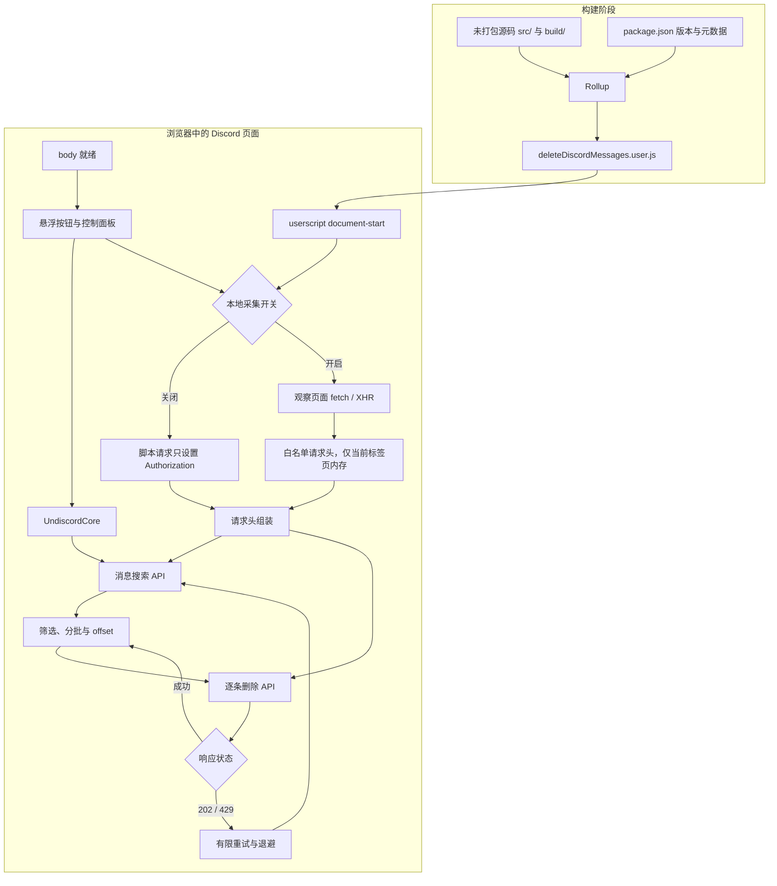

# dc-autopurge

**中文** | [English](./README_EN.md)

> **Based on [victornpb/undiscord](https://github.com/victornpb/undiscord)** — 二次开发的 Discord 消息批量删除油猴脚本。
>
> A Tampermonkey userscript for bulk-deleting your Discord messages, with a full Chinese / English UI.

## ✨ 功能特性

- **原生请求头采集**（高级设置内可开关）：自动复用 Discord 客户端自己的请求指纹，不写死任何值；采集失败时自动降级，不影响正常使用。
- **可变节奏**：删除与搜索间隔随机化，模拟真人操作节奏，告别固定间隔。
- **限流保护**：遇到限流自动退避等待、有限重试，不会卡死在某一条消息。
- **中英双语**：默认中文，可切换英文或跟随浏览器语言。
- **悬浮按钮**：右下角圆形按钮，可拖动、位置记忆，不依赖 Discord 页面结构，Discord 改版也不会消失。
- **Token**：自动从当前登录会话检测，也可手动输入。

## 📦 安装

1. 安装 Tampermonkey（或 Violentmonkey）。
2. 下载 `deleteDiscordMessages.user.js` 并安装。
3. 打开 Discord 网页版，右下角出现悬浮按钮即安装成功。

## 🚀 使用

1. 点击悬浮按钮打开面板。
2. 确认 Token（自动检测或手动填写）。
3. 填写作者 ID / 服务器 ID / 频道 ID（留空 = 当前上下文）。
4. 设置搜索间隔、删除间隔等参数，开始删除。

## 🏗 架构

## ⚠️ 风险提示

- 批量删除属于 Discord 定义的 self-bot 行为，**有封号风险**，建议用小号操作。
- 本脚本只用于学习交流。
- Token 等同账号密码，只保存在本机，不要发给任何人。

## 📄 License

MIT License — 基于 [victornpb/undiscord](https://github.com/victornpb/undiscord) 二次开发，保留原作者版权声明。

© 2026 moequan（修改部分）
