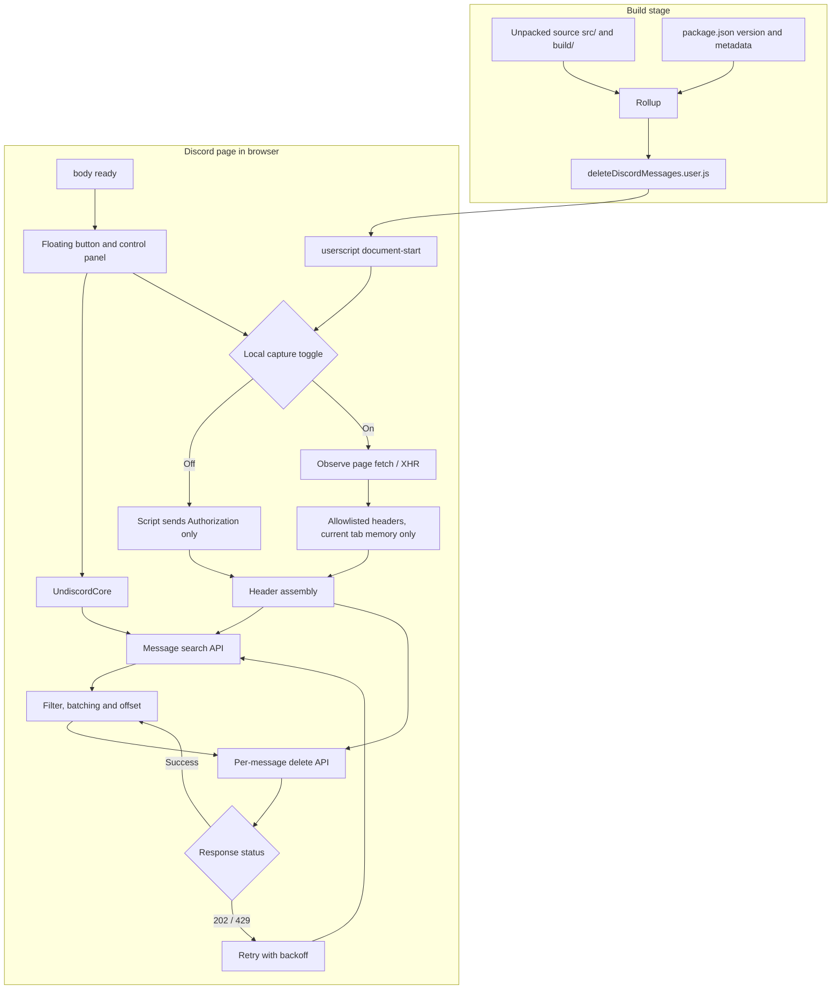

# dc-autopurge

[中文](./README.md) | **English**

> **Based on [victornpb/undiscord](https://github.com/victornpb/undiscord)** — a Tampermonkey userscript for bulk-deleting your Discord messages.
>
> 基于 victornpb/undiscord 二次开发的 Discord 消息批量删除油猴脚本。

## ✨ Features

- **Native header capture** (toggleable in Advanced Settings): automatically reuses the Discord client's own request fingerprints instead of hardcoding any values; gracefully falls back on capture failure without affecting normal use.
- **Variable pacing**: randomizes delete and search intervals to mimic human behavior — no more metronome-like fixed intervals.
- **Rate-limit protection**: automatically backs off and retries when rate-limited, never gets stuck on a single message.
- **Bilingual UI**: defaults to Chinese, switchable to English or follow browser language.
- **Floating button**: draggable circular button in the bottom-right corner with position memory; independent of Discord's DOM, so Discord redesigns won't make it disappear.
- **Token**: auto-detected from your current login session, or entered manually.

## 📦 Installation

1. Install Tampermonkey (or Violentmonkey).
2. Download and install `deleteDiscordMessages.user.js`.
3. Open Discord Web — the floating button appears in the bottom-right corner once installed.

## 🚀 Usage

1. Click the floating button to open the panel.
2. Confirm your token (auto-detected or entered manually).
3. Fill in author ID / server ID / channel ID (blank = current context).
4. Set search / delete intervals and start.

## 🏗 Architecture

## ⚠️ Risks

- Bulk deletion is considered self-botting by Discord — **your account may be banned**. Use an alt account.
- This script is for learning purposes only.
- Your token is as sensitive as your password — it stays on your machine, never share it with anyone.

## 📄 License

MIT License — based on [victornpb/undiscord](https://github.com/victornpb/undiscord), original copyright retained.

© 2026 moequan (modifications)
